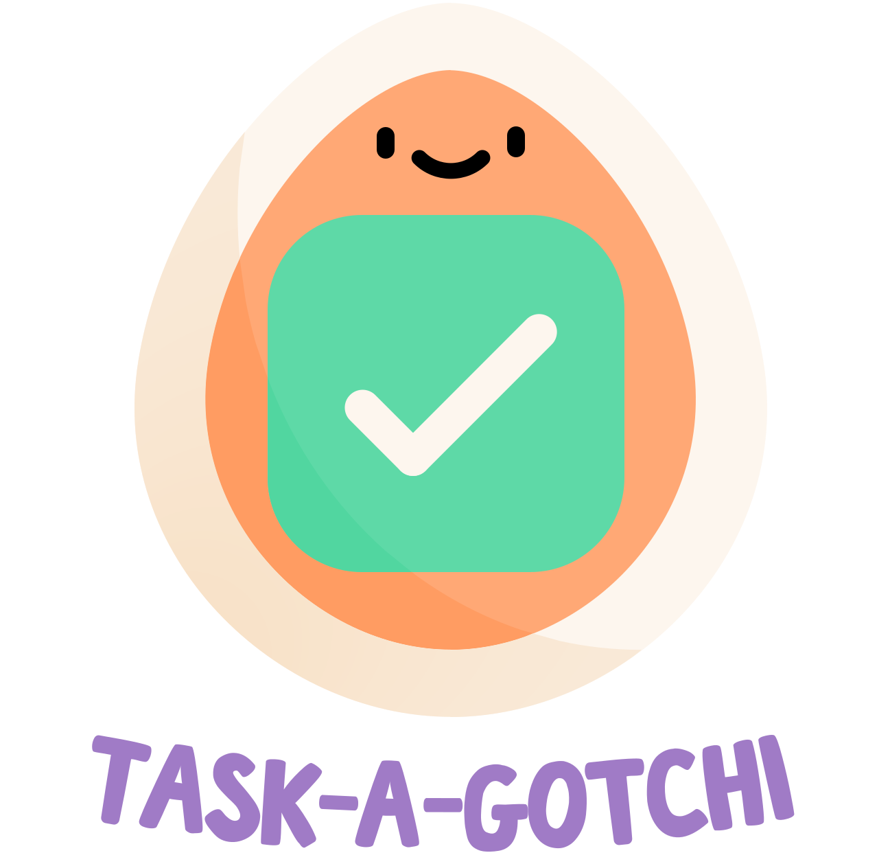

# 

Gamify your habits to beat your procrastination with Task A Gotchi.

## Problem Statement (2024 Flagship Hackathon UNSW)

In a world where screens have become the new digital playground, every need is just a click away. The new
generation has now become one filled with ‘iPad kids’ - children who spend excessive amounts of time scrolling
on TikTok or playing video games. However, as your parents always said, nothing is more important than your
health! Sedentary lifestyles have become a growing concern due to physical inactivity, poor dietary habits, and
mental health challenges.

So, it’s time to be innovative and promote healthier habits! From your mental to your physical health - there are
numerous avenues to explore and problems you could choose to solve. So what are you waiting for?

Your Task: Create a technical (or non-technical) solution to address these problems (e.g. physical inactivity,
mental health)

## What is Task A Gotchi?

## Built with

- Next.js - Development environment
- Tailwind CSS - CSS framework
- MongoDB - NoSQL Database
- Ant Design - Components library for User Interface
- Zustand - State management tool
- Zustand Persist - Persist state in a Zustand store
- Prisma - Node.js and TypeScript ORM
- bcryptjs - Encryption
- jose - Authentication
- react-github-contribution-calendar - Contribution component
- react-countup - Counting animation with Ant Design
- react-countdown-circle-timer - Countdown component

## Author

Phot Koseekrainiramon (Project Lead & Fullstack Developer)
- [LinkedIn](https://www.linkedin.com/in/phot-kosee/)
- [GitHub](https://github.com/photkosee)

Dalton Emanuel Mojica (Designer & Presenter)
- [LinkedIn](https://www.linkedin.com/in/daltonmojica/)
- [GitHub](https://github.com/daltonmojica)